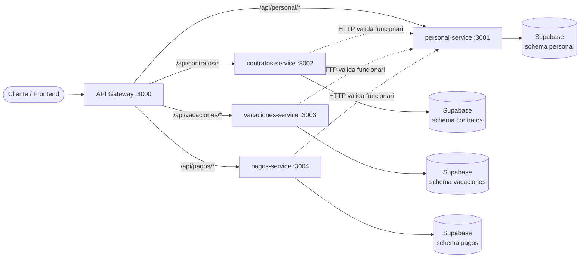

# Hackathon ARCA — Sistema de Gestión Humana

**Primera Hackatón — 05/05/2026**
**Cliente:** ARCA LTDA (servicios auxiliares financieros)

## Integrantes

- Juan José Cordeiro
- Marvin Mollo
- Alan Flores
- Sergio Arias
- Leonardo Delgado
- Chris Coronel

## Problema y solución

ARCA LTDA evalúa comprar SALAR/SPYRAL para gestión de personal. Antes de tomar la decisión, el Directorio pidió un MVP in-house que demuestre que pueden cubrir las funcionalidades críticas. Este repo contiene el backend en microservicios cumpliendo esos cuatro frentes: personal, contratos, pagos y vacaciones, expuestos por un único API Gateway.

## Stack

- **Backend:** Node.js + Express + Prisma
- **Base de datos:** Supabase (Postgres hosted) — una instancia, **schema-per-service**
- **API Gateway:** Express + `http-proxy-middleware`
- **Orquestación local:** `concurrently` (sin Docker)
- **Hot reload:** `nodemon`

## Servicios y puertos

| Servicio              | Puerto | Schema     | Ponderación | Responsabilidad                                        |
|-----------------------|--------|------------|-------------|--------------------------------------------------------|
| `api-gateway`         | 3000   | —          | —           | Único punto de entrada, ruteo `/api/<servicio>/*`      |
| `personal-service`    | 3001   | personal   | 60%         | CRUD de funcionarios — base del resto                  |
| `contratos-service`   | 3002   | contratos  | 80%         | Generación y consulta de contratos con template        |
| `vacaciones-service`  | 3003   | vacaciones | 70%         | Solicitud y saldo de vacaciones (15 días/gestión)      |
| `pagos-service`       | 3004   | pagos      | 100%        | Boletas con cálculo AFP 12.71%, Salud 3%, bonos        |

## Arquitectura



Patrón: **microservicios + schema-per-service** sobre una sola instancia de Postgres en Supabase. Cada servicio aísla sus datos en su propio schema y solo se comunica con `personal-service` para validación cruzada de funcionarios vía HTTP.

## Cómo correr

### 1) Requisitos

- Node.js 18+
- Cuenta de Supabase con un proyecto creado

### 2) Configurar `.env` por service

En cada uno de los 4 services hay un `.env.example`. Copialo a `.env` y reemplazá la URL:

```bash
cp personal-service/.env.example   personal-service/.env
cp contratos-service/.env.example  contratos-service/.env
cp vacaciones-service/.env.example vacaciones-service/.env
cp pagos-service/.env.example      pagos-service/.env
cp api-gateway/.env.example        api-gateway/.env
```

Cada service usa la **misma** `DATABASE_URL` de Supabase con un `?schema=` distinto (`personal`, `contratos`, `vacaciones`, `pagos`). Para `prisma migrate` se usa además `DIRECT_URL` (puerto 5432 sin pgbouncer).

### 3) Instalar dependencias

```bash
npm install
npm --prefix personal-service install
npm --prefix contratos-service install
npm --prefix vacaciones-service install
npm --prefix pagos-service install
npm --prefix api-gateway install
```

### 4) Aplicar migraciones (crea los 4 schemas en Supabase)

```bash
npm run migrate:all
```

### 5) Sembrar datos de prueba (3 funcionarios)

```bash
npm --prefix personal-service run seed
```

### 6) Levantar todo en paralelo

```bash
npm run dev
```

Esto arranca los 5 procesos con `concurrently`. El gateway queda en `http://localhost:3000`.

## Endpoints clave (vía gateway)

```
GET  /health
GET  /api/personal/funcionarios
POST /api/personal/funcionarios
PUT  /api/personal/funcionarios/:id
DEL  /api/personal/funcionarios/:id

POST /api/contratos/contratos
GET  /api/contratos/contratos/:id/documento

POST /api/pagos/boletas
GET  /api/pagos/boletas?funcionarioId=&periodo=

POST /api/vacaciones/vacaciones
GET  /api/vacaciones/vacaciones/saldo/:funcionarioId
```

Ver [docs/evidencia.md](docs/evidencia.md) para curls completos con response esperado.

## Documentación adicional

- [docs/arquitectura.md](docs/arquitectura.md) — diagrama C4 nivel 2 y decisiones técnicas
- [docs/historias.md](docs/historias.md) — historias de usuario por módulo
- [docs/evidencia.md](docs/evidencia.md) — evidencia de pruebas (curl + JSON)
- [docs/test-e2e.ps1](docs/test-e2e.ps1) — script PowerShell de prueba end-to-end
- [docs/retrospective.md](docs/retrospective.md) — retrospectiva del sprint
