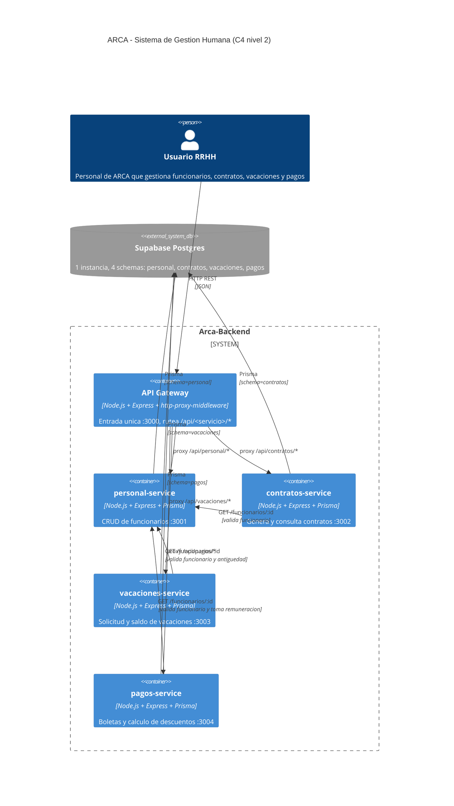

# Arquitectura — Sistema de Gestión Humana ARCA

## Vista C4 — Nivel 2 (Containers)

## Decisiones de arquitectura

### 1) Microservicios + schema-per-service
Cada dominio (personal, contratos, vacaciones, pagos) es un service Node independiente con su propio schema en Postgres. Esto cumple la rúbrica del hackathon (que pide microservicios) y nos da aislamiento de datos sin la complejidad de N bases físicas: una sola instancia de Postgres con cuatro schemas, accedidos via Prisma con `?schema=` en la connection string.

**Trade-off aceptado:** la BD es punto único de falla a nivel infra, pero a nivel lógico cada schema es completamente aislado y los services no se conocen entre sí en lo que respecta a datos. La validación cruzada se hace por HTTP, no por joins.

### 2) Comunicación inter-service por HTTP REST
Cuando contratos, vacaciones o pagos necesitan validar un funcionario, hacen `GET http://localhost:3001/funcionarios/:id` con `axios` (timeout 3s). Ante 404 devolvemos 400 al cliente; ante caída devolvemos 503. No usamos cola de mensajes ni gRPC: para 6 personas en 4 horas, REST es lo correcto.

### 3) Supabase, no Docker
La opción original era levantar Postgres en Docker Compose. La rechazamos por dos razones:
- En Windows, Docker Desktop agrega un riesgo operativo que no podemos asumir contra reloj.
- Supabase nos da la BD lista, con UI para inspección, sin instalación local.

A cambio, los services se orquestan localmente con `concurrently` desde un `package.json` raíz. Cinco procesos Node, hot-reload con `nodemon`, todo logea con prefijos coloreados.

### 4) API Gateway como punto único de entrada
Patrón Backend-for-Frontend simplificado: el gateway en `:3000` proxea `/api/<servicio>/*` al service correspondiente. Beneficios:
- Cliente solo conoce un puerto.
- CORS centralizado.
- Espacio futuro para auth, rate limiting, logging cross-cutting.

### 5) Sin autenticación
La rúbrica no la pide y no era prioridad ante el deadline. El código deja espacio para meter middleware de auth en el gateway sin tocar los services.

### 6) Prisma como ORM
- Migraciones declarativas (`prisma migrate dev`) que crean los schemas automáticamente al primer run.
- Type-safety implícita por `@prisma/client` generado.
- Evita SQL crudo y sus errores típicos.

## Reglas de negocio implementadas

- **Vacaciones:** 15 días por gestión completa (año calendario), antigüedad mínima 1 año, saldo = (años × 15) − días ya gozados en la gestión actual.
- **Pagos:** AFP 12.71% del bruto, Salud 3% del bruto, neto = bruto − AFP − salud + bonos. Constraint `@@unique(funcionarioId, periodo)` evita duplicados.
- **Contratos:** template con placeholders `{{nombre}}`, `{{apellido}}`, `{{ci}}`, `{{salario}}`, `{{fechaIngreso}}`, `{{periodoPrueba}}`. Render via `String.replace` con regex, sin Handlebars.
- **Personal:** baja lógica (`activo=false`), no borra registro físico.
